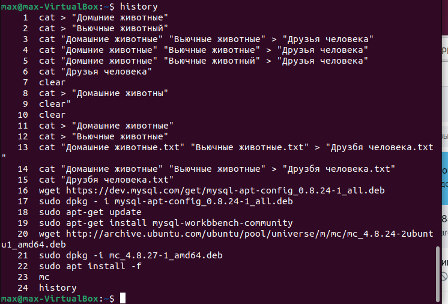

1.	Используя команду cat в терминале операционной системы Linux, создать два файла Домашние животные (заполнив файл собаками, кошками, хомяками) и Вьючные животными заполнив файл Лошадьми, верблюдами и ослы), а затем объединить их. Просмотреть содержимое созданного файла. Переименовать файл, дав ему новое имя (Друзья человека):
•	cat > "Домашние животные.txt"
•	cat > "Вьючные животные.txt"
•	cat "Домашние животные.txt" "Вьючные животные.txt" > "Друзья человека.txt"
•	cat "Друзья человека.txt"

2.	Создать директорию, переместить файл туда:
•	mkdir > "Питомниик"
•	mv "Друзья человека.txt" /home/mv/Питомник

3.	Подключить дополнительный репозиторий MySQL. Установить любой пакет из этого репозитория.
•	wget https://dev.mysql.com/get/mysql-apt-config_0.8.24-1_all.deb
•	sudo dpkg - i mysql-apt-config_0.8.24-1_all.deb
•	sudo apt-get update
•	sudo apt-get install mysql-workbbench-community

4.	Установить и удалить deb-пакет с помощью dpkg:
•	wget http://archive.ubuntu.com/ubuntu/pool/universe/m/mc/mc_4.8.24-2ubuntu1_amd64.deb
•	sudo dpkg -i mc_4.8.27-1_amd64.deb
•	sudo apt install -f
•	mc
•	sudo dpkg -r mc

5. Выложить историю команд в терминале ubuntu

6. Нарисовать диаграмму, в которой есть класс родительский класс, домашние
животные и вьючные животные, в составы которых в случае домашних
животных войдут классы: собаки, кошки, хомяки, а в класс вьючные животные
войдут: Лошади, верблюды и ослы).

            Животные
                |
        ---------------  
        |             |
   Домашние      Вьючные
     |              |
-------------     -------------
|           |     |           | 
Собаки   Кошки  Хомяки  Лошади        
                       /     \
                  Верблюды  Ослы

7 - 12. myDB.sql
13. Animal (task_13)
14. Animal (task_14)